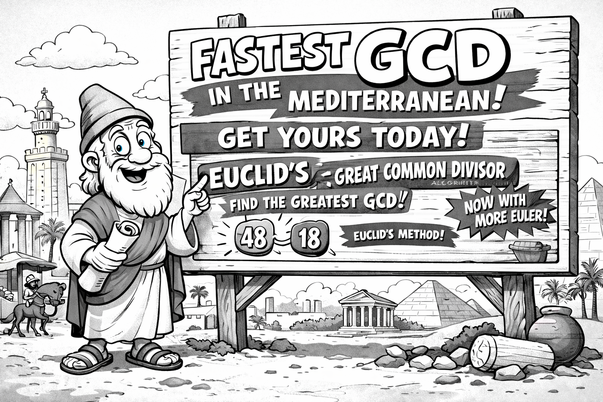
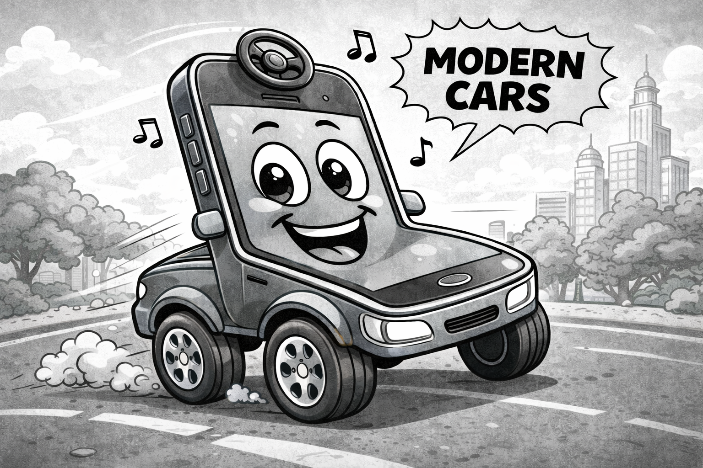

# Some random thoughts

This is a collection of semi-random (but interconnected) topics and thoughts
that might be amenable to contribute shaping up a public-engagement event
on the general subject of *ethical software*.

## The rise of the algorithm

In a world where the word *algorithm* is literally ubiquitous, and the very
concept seems to be elevated to the status os a Hobbesian Leviathan that is
controlling each single aspect of our lives, it might be worth reminding that
there isn't really anything particularly hard to grasp in the thing.

Algorithm: *a procedure for solving a mathematical problem (as of finding the
greatest common divisor) in a finite number of steps that frequently involves
repetition of an operation.* (Source:
[Merriam-Webster](https://www.merriam-webster.com/dictionary/algorithm))

This is it. Really. In fact the concept of algorithm is germane to that of
a cooking recipe, in that the latter is basically explaining you step by step
how to turn a whole bunch of seemingly unrelated ingredients into your
favorite dish. (Well, I will give you that you cannot really push this analogy
*too* far. For one thing recipes are for humans, and they are almost never
as precise as you would expect an actual algorithm to be, as there is a lot
of common context that comes into play when cooking. But bear with me for
a moment, as the analogy is good enough to illustrate the point I am getting
to.)

### Planet Deliveria

Now imagine for a second living on a different planet in which cookbooks and
online recipes do not exist. (To make things more dramatic we shall call this
planet Deliveria.) Life on Deliveria proceeds pretty much like on the Earth,
except that, when it comes to eating, all the production has been centralized
in a small number of *certified* big companies that run physical restaurants
and catering services. Sure enough, you can go eat in you favorite place or
get food delivered home, but houses come without kitchens. You would't know
what to do with one anyway, as all the recipes are kept secret in the hands
of three or four *"Big Cook"* companies. And people are explicitly forbidden
by the government from cooking for security reasons.

*Generated by ChatGPT image generator 4o.*

On a closer look, things are even worst. Whenever one of the Big Cook comes
up with a new recipe, things are setup so that they can file for a patent and
prevent any other company from cooking the same thing without explicit
permission. (In practice the few Big Cook companies are pretty forgiving with
each other, and the main practical implication of this setup is that the entry
barrier for new companies is pretty high, but this is bringing us on a tangent,
so let's leave it at that.)

I know, I know. If you are thinking that all of this is pretty silly, I am
with you. You don't *really* see any of this happening, and neither do I.
One of the main reasons why planet Deliveria is an unlikely setting is that
cooking is relatively easy and recipes are not really hard to
*reverse-engineer* (keep this expression in mind as we shall go back to it)
and teach someone else. Even in situation in which the government was actively
trying to perpetuate the status quo, it wouldn't probably take much time
for a variegate black market to flourish. And yet I am sure everybody can
see some scary resemblance with our fellow planet Earth, and maybe we can
make things more realistic in a slightly different context.

### Euclid

Roll back to c. 300 BC in Alexandria (Egypt), Euclid's elements describe
what is believed to be the first algorithm historically documented in western
literature that continues to be relevant to date: the Euclidean algorithm to
find the greatest common divisor between two numbers.

*Generated by ChatGPT image generator 4o.*

I am not a mathematician, and certainly not ah historian of science, so I
cannot tell for sure whether this can be considered a discontinuity in the
development of arithmetics---one of those discoveries that literally change
the line of events. It's also almost certain that the formulation of the
algorithm is not to be credited to to Euclid himself, but I think it is fair
to say this was a *big* thing at the time, and we'll just leave it at that.

Now let's pretend for a second we are in the *Back to the future* movie and
we are free to explore alternative timelines. Let's imagine that Euclid,
instead of publishing the *Elements*, walks out of his house and hangs to
the wall overlooking the street a huge, flamboyant billboard reading:

*Magic papyrus scrolls for sale! You write two numbers and their greatest
common divisor appears immediately below in seconds.
Award-winning technology, money back guaranteed.*

And maybe the fine prints, just below:

*Patent pending. (C) Euclid Inc., all rights reserved.*

Extrapolating 2300 years in time is far from trivial, but I do believe it is
fair to say that we would live in a very different world today. This is not
how hard sciences progressed over the history of human kind. On the contrary:
scientific research thrived over pillars such as the idea of free exchange
of information, being able to build upon everybody else's achievements and
giving proper credit to people by simply citing the relevant sources. I will
not deny that the process is not perfect and, as all human things, is subject
to hiccups (and even manipulation), but all in all this is what gave us a
number of beautiful things such as: a language with which we can describe
Nature (mathematics), quantum mechanics (upon which all modern electronic
devices are deeply rooted), computers and the world wide web.

This is not to say that there is something intrinsically wrong in monetizing
you work, if this is what floats your boat. The real point is that there is
at least another way of doing business, which proved beyond any reasonable
doubt to be effective. The question, then, is really which one is more
effective in any given situation. And yet this is a consideration that seems
more and more overlooked, as we accept compromises and limitations of our
freedom in specific contexts that, when translated verbatim in slightly
different situation would not pass the laugh test.

We shall try and elaborate more on this very topic in the remaining of this
section.

## Free as in free speech

The four freedoms.

Free software vs. open source [Stallman, chapter 6]

## Source code and machine code

Source code, machine code, reverse engineering.

## Licenses: why should I care?

Copyleft. Licenses. (Software patents?)

## What does software applies to?

In the old days, when you bought something, it was yours. Period.
Nowadays this is not necessarily the case, anymore, and the line tends to
get more and more blurred.

There is a famous story in free software folklore about the paradoxical
situation of a farmer who buys a tractor (and maybe a very expensive one)
and then, in the unfortunate event that something breaks, they cannot
repair it themselves *even if they had the technical ability*, just because
the manufacturer dictates that they have to resort to an authorized
workshop. Clearly, this is somewhat germane to the situation where you buy
a computer but the warranty conditions prevent you from modifying the
operating system.
(And the story is actually more than just folklore, as the

case nicely illustrates.)

I have to say I never really resonated with the farmer and tractor story
myself. That might be due to my high-school reminiscences of Stalin's
agricultural reform of the 1930s failing due to the lack of technical
expertise of the farmers. (Which is, obviously, also an oversimplification
and largely folklore in itself.)

*Generated by ChatGPT image generator 4o.*

Then last year me and my wife decided to replace our 13-years old car with
a brand new full-electric car. Boy this was shocking! The thing is basically
a smartphone on four wheels. Now I *do* start to get it. Tech oriented as I
am, my immediate desire to have the root password for the car stumbles
upon what are undoubtedly legitimate questions. I guess I would do no harm
by customizing the entertainment system, but shall I be allowed to tinker
with the braking system of the car? Or with the battery? And then, if
something tragic happens, who is responsible? This is a very difficult
problem, and one to which I honestly have no good answer.

But if now you remove the wheels from the smartphone, I am back into the
"very strong feelings" mode. This is why I was shocked to hear that
starting from  late 2026, *apps sideloaded onto certified Android devices must
come from developers who have completed Google's identity verification
process*. [Put a reference.] Wait a minute! I got myself a smartphone, paid
for it, and cannot upload to it my little hobby app without going through
the google app store? That, in all honesty, seems like a stretch, indicating
that we have reached the point where the power of the big companies is so
pervasive that we effectively don't own things anymore in the traditional
sense.

## Free software: is it any good?

Did you know that free software is running the web?

## Web neutrality

## Software and IT infrastructures

## Privacy in the times of social media

## Information in the times of social media

Fake news. Social media as echo chambers.
